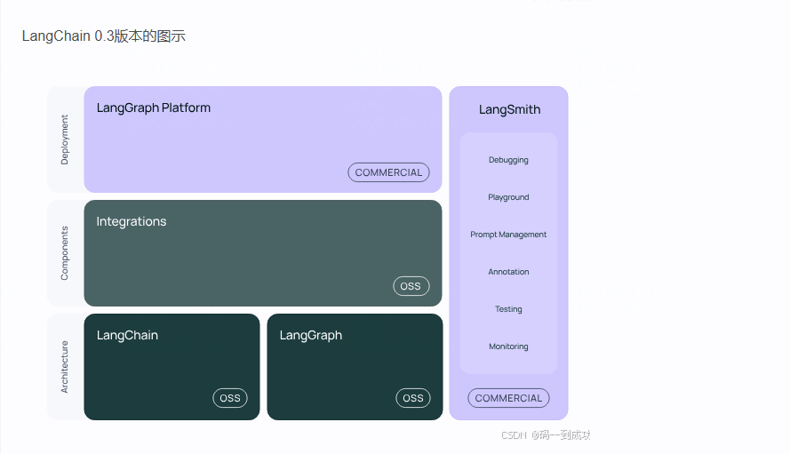

### 1. LangChain 0.3版本的图示

###  2. 为什么使用LangGraph
1. 链（Chain）的局限性
+ 在LangChain中，链（Chain）是一种基本的构建块，用于将多个LLM（语言模型）调用和工具调用链接在一起。然而，链在处理复杂、动态的对话流程时存在一些局限性：

+ 线性流程：链通常是线性的，这意味着它们只能按照预定义的顺序执行步骤。这种线性结构限制了在对话中进行动态路由和条件分支的能力。

+ 状态管理：链在处理多轮对话时，状态管理变得复杂。每次调用链时，都需要手动传递和更新状态，这增加了代码的复杂性和出错的可能性。

+ 工具集成：虽然链可以调用外部工具，但在链的结构中集成和协调多个工具的使用并不直观，尤其是在需要根据对话上下文动态选择工具时。

2. LangGraph解决的问题
+ 图结构：LangGraph采用图（Graph）结构来表示对话流程，允许开发者定义复杂的非线性流程和条件分支。这种图结构提供了更大的灵活性，使得动态路由和条件分支变得直观和简单。

+ 状态管理：LangGraph内置了强大的状态管理机制，可以无缝地管理多轮对话的状态。开发者无需手动传递和更新状态，LangGraph会自动处理状态的持久化和恢复。

+ 工具集成：LangGraph简化了工具的集成和使用，开发者可以轻松地将多个工具集成到对话流程中，并根据对话上下文动态选择和调用工具。

+ 持久性：LangGraph提供了内置的状态持久性机制，支持长时间运行的对话。开发者可以随时暂停和恢复对话，无需担心状态丢失。
